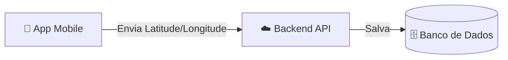

# 📦 Projeto Rastreador Logístico - Fase 1

Este repositório contém o código fonte da **Fase 1** do sistema de rastreamento de entregas. O objetivo desta fase é estabelecer a comunicação básica entre o entregador (App Mobile) e a central (Backend), enviando coordenadas GPS em tempo real.

## 🏗️ Arquitetura da Fase 1

O sistema funciona no seguinte fluxo de dados:



## 🚦 Status do Desenvolvimento

Abaixo, o status atual de cada componente planejado para esta fase:

### 📱 1. Frontend Mobile (React Native + Expo)

* [x] Criação da estrutura do projeto (Expo Router)
* [x] Configuração de permissões de usuário (GPS)
* [x] Captura de coordenadas em tempo real (Latitude/Longitude)
* [x] Lógica de envio HTTP (POST Request)
* [x] Interface visual de feedback (Status de envio)

### 🖥️ 2. Backend & API (Node.js)

* [ ] **Criação do Servidor Express** (🚧 A Fazer)
* [ ] **Rota POST `/gps` para receber dados** (🚧 A Fazer)
* [ ] **Validação dos dados recebidos** (🚧 A Fazer)

### 🗄️ 3. Persistência de Dados

* [ ] **Integração com Banco de Dados (SQLite/JSON)** (🚧 A Fazer)

---

## ⚙️ Configuração do App Mobile

Como o Backend ainda será implementado localmente, é necessário apontar o App para o IP do seu computador.

1. Descubra seu IP local (no terminal: `ipconfig` ou `ifconfig`).
2. Abra o arquivo `app/index.tsx`.
3. Atualize a constante `backendUrl`:

```ts
// Substitua pelo seu IPv4
const backendUrl = 'http://192.168.X.X:3000/gps';
```

---

## 🚀 Como Rodar o App (Mobile)

1. **Instale as dependências:**

```bash
npm install
```

2. **Inicie o servidor do Expo:**

```bash
npx expo start -c
```

3. **Abra no Celular:**

* Utilize o app **Expo Go** para escanear o QR Code gerado no terminal.

---

## 🔮 Próximos Passos

A próxima etapa imediata é o desenvolvimento do **Componente 2 (Backend)** para que o aplicativo pare de receber erros de conexão e comece a salvar os dados efetivamente.

---

*Projeto desenvolvido para fins de estudo de logística e geolocalização.*
